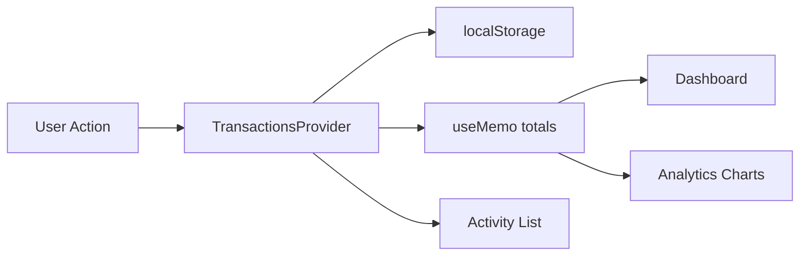

<div align="center">

# 💰 Financial Serenity

### *Your money, beautifully organized — one tap at a time.*

A **mobile-first expense tracker** with editorial styling, real-time balance insights, and charts that actually help you spend smarter.

<br />

[](https://react.dev/)
[](https://tanstack.com/start)
[](https://www.typescriptlang.org/)
[](https://vitejs.dev/)
[](https://recharts.org/)

<br />

[🚀 Live Demo](https://my-expense-hub.vercel.app) · [📖 Features](#-features) · [⚡ Quick Start](#-quick-start) · [🛠 Tech Stack](#-tech-stack)

<br />


</div>

---

## ✨ Why Financial Serenity?

Most expense apps feel cluttered. **Financial Serenity** is built around calm, editorial design — big readable numbers, soft cards, and a bottom nav that keeps every screen one thumb-reach away.

| | |
|---|---|
| 📱 **Mobile-first** | Centered app frame (480px) that feels native on phone, still polished on desktop |
| ⚡ **Instant feedback** | Income, expenses, and balance update the moment you add or edit a transaction |
| 📊 **Visual clarity** | Donut chart by category + 6-month spending trend — no spreadsheet required |
| 💾 **Works offline** | All data lives in your browser via `localStorage` — no account needed |

---

## 📱 Screens

| Screen | What you get |
|--------|----------------|
| **🏠 Dashboard** | Total balance, income vs expense summary, recent activity, quick link to analytics |
| **📋 Activity** | Full transaction list grouped by *Today*, *Yesterday*, and date labels |
| **➕ Add / Edit** | Add income or expense with category, date, merchant & notes — edit via `?id=` |
| **📈 Analytics** | Month picker, category donut, top spend insight, 6-month bar chart |

---

## 🎯 Features

- ✅ **Full CRUD** — create, read, update, and delete transactions
- ✅ **Smart grouping** — transactions sorted into human-friendly date buckets
- ✅ **11 categories** — Food, Dining, Tech, Travel, Bills, Health, and more with icons & colors
- ✅ **Seed data** — sample transactions on first visit so charts aren’t empty
- ✅ **Category filtering** — drill into spending by category on the Activity screen
- ✅ **Month-over-month** — compare current vs previous month in Analytics
- ✅ **Smooth UX** — page fade transitions and a persistent bottom navigation bar

---

## 🖼 Preview

```
┌─────────────────────────────┐
│  Financial Serenity    👤   │
├─────────────────────────────┤
│      Total Balance          │
│       $12,450.00            │
│    ▲ +2.4% this month       │
│                             │
│  ┌─────────┐ ┌─────────┐   │
│  │ Income  │ │ Expense │   │
│  └─────────┘ └─────────┘   │
│                             │
│  Recent Activity            │
│  • Apple Store      -$1,299 │
│  • Monthly Salary   +$6,500 │
│                             │
├─────────────────────────────┤
│  🏠 Home  📋  ➕  📈 Stats  │
└─────────────────────────────┘
```

---

## ⚡ Quick Start

### Prerequisites

- **Node.js** 18+  
- **npm** (or pnpm / yarn)

### Install & run

```bash
# Clone the repo
git clone https://github.com/Ashish-kumar-upadhyay/my-expense-hub.git
cd my-expense-hub

# Install dependencies
npm install

# Start dev server
npm run dev
```

Open the URL shown in your terminal (usually `http://localhost:5173`).

### Other commands

| Command | Description |
|---------|-------------|
| `npm run build` | Production build (Nitro + SSR output in `.output`) |
| `npm run preview` | Preview the production build locally |
| `npm run lint` | Run ESLint |
| `npm run format` | Format code with Prettier |

### Reset data

Transactions are stored under **`fs.transactions.v1`** in `localStorage`.

```js
// Run in browser DevTools console
localStorage.removeItem('fs.transactions.v1');
location.reload();
```

---

## 🛠 Tech Stack

| Layer | Technology |
|-------|------------|
| **Framework** | [React 19](https://react.dev/) + [TanStack Start](https://tanstack.com/start) (file-based routing, SSR-ready) |
| **Build** | [Vite 7](https://vitejs.dev/) + [Nitro](https://nitro.build/) (Vercel deployment) |
| **Routing** | [TanStack Router](https://tanstack.com/router) |
| **Styling** | Custom editorial CSS (`src/styles/app.css`) + [Tailwind CSS 4](https://tailwindcss.com/) |
| **UI primitives** | [Radix UI](https://www.radix-ui.com/) + shadcn-style components |
| **Charts** | [Recharts](https://recharts.org/) — donut & bar charts |
| **Icons** | [Lucide React](https://lucide.dev/) |
| **State** | React Context + `useMemo` (`src/lib/transactions.tsx`) |
| **Persistence** | Browser `localStorage` (hydrated on mount, synced on every change) |

---

## 📁 Project Structure

```
my-expense-hub/
├── src/
│   ├── routes/           # File-based pages (Dashboard, Activity, Add, Analytics)
│   ├── components/       # AppShell, TransactionItem, UI primitives
│   ├── lib/              # Transactions store, categories, utilities
│   ├── styles/           # Editorial app.css
│   └── server.ts         # SSR server entry
├── vite.config.ts        # TanStack Start + Nitro + React
└── package.json
```

---

## 🚀 Deployment

This app uses **TanStack Start with Nitro** — deploy to [Vercel](https://vercel.com) with zero extra config:

1. Push to GitHub  
2. Import the repo on Vercel  
3. Build command: `npm run build`  
4. Leave **Output Directory** empty (Nitro handles it)

> **Note:** Do not set `outputDirectory` to `dist` — that causes a 404 on Vercel for SSR apps.

---

## 🧠 Architecture



- **Single source of truth** — `TransactionsProvider` owns all CRUD and derived totals  
- **Edit flow** — `/add?id=<txId>` reuses the same form for updates  
- **Analytics** — filters expenses by month, aggregates per category for Recharts  

---

## 🔮 Roadmap

- [ ] Swipe-to-delete on transaction rows  
- [ ] Custom categories & color picker  
- [ ] CSV export / import  
- [ ] Vitest tests for store & date grouping  
- [ ] Page transitions with Framer Motion  

---

## 👤 Author

**Ashish Kumar Upadhyay**

- GitHub: [@Ashish-kumar-upadhyay](https://github.com/Ashish-kumar-upadhyay)

---

<div align="center">

**Built with care for clarity, not clutter.**

⭐ Star the repo if you find it useful!

</div>
